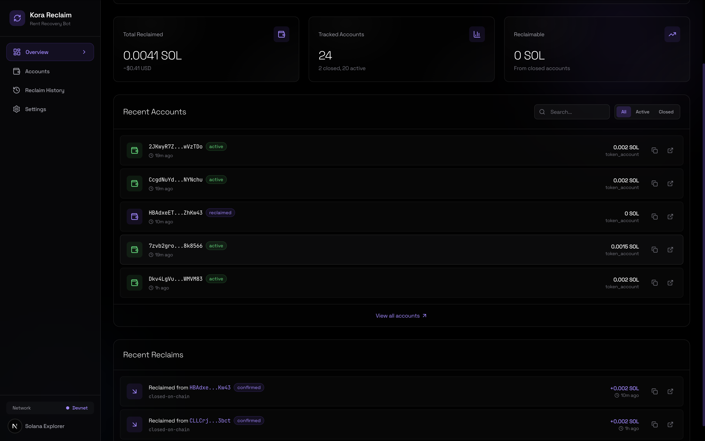

# Kora Rent-Reclaim Bot

Automated rent recovery for Kora-sponsored Solana accounts.



## The Problem

[Kora](https://launch.solana.com/docs/kora/operators) lets apps sponsor transactions on Solana so users don't need SOL. When Kora sponsors account creation, SOL gets locked as **rent** (~0.002 SOL per token account). Over time, many of these accounts get closed or abandoned, but the rent is never tracked or recovered. This is silent capital loss for operators.

## How It Works

### Kora Sponsorship and Rent Locking

```
User creates account  -->  Kora signs as fee payer  -->  SOL locked as rent
                                                              |
Account gets closed   -->  Rent SOL released         -->  Who tracks this?
```

When a Kora node sponsors a transaction, the **signer keypair** (configured in `signers.toml`) pays:
- Transaction fees (~0.000005 SOL)
- **Rent deposit** (~0.00203 SOL per token account)

The rent stays locked until the account is closed. Operators have no visibility into how much rent is locked across hundreds or thousands of sponsored accounts.

### What This Bot Does

```
npm run bot
```

One command. The bot runs continuously and handles everything:

1. **Discovers** all accounts where your Kora signer paid rent
2. **Monitors** those accounts every minute for closures
3. **Reclaims** rent automatically when a closure is detected
4. **Reports** what was reclaimed and how much

No manual CLI commands needed. Start it and it works.

## Quick Start

### Prerequisites

- Node.js 18+
- A Solana keypair (`keypair.json`)
- A running [Kora node](https://launch.solana.com/docs/kora/getting-started)

### Install

```bash
git clone <repo-url>
cd kora-rent-reclaim-bot
npm install
```

### Configure

Edit `.env`:

```bash
SOLANA_NETWORK=devnet
SOLANA_RPC_URL=https://api.devnet.solana.com

# Your Kora signer address (from signers.toml)
KORA_SIGNER_PUBKEY=<your-signer-pubkey>
KORA_RPC_URL=http://localhost:8082

# Operator keypair for signing reclaim transactions
OPERATOR_KEYPAIR_PATH=./keypair.json

# Bot settings
MONITOR_INTERVAL_MINUTES=1    # How often to check (minutes)
MIN_DORMANCY_DAYS=0           # Days to wait after closure before reclaiming
MIN_RECLAIM_LAMPORTS=0        # Minimum lamports to bother reclaiming
DRY_RUN=false                 # Set true to simulate without executing
AUTO_RECLAIM=true             # Automatically reclaim when closures detected
```

### Run

```bash
# Start the bot (discovers, monitors, auto-reclaims)
npm run bot
```

That's it. The bot will discover sponsored accounts on startup, then monitor and reclaim on a loop.

## Demo: Full Lifecycle on Devnet

This demo shows the complete cycle: create accounts through Kora, start the bot, close an account, watch the bot reclaim the rent.

### 1. Start Kora node

```bash
cd ~/kora-demo

KORA_SIGNER_KEY="<your-private-key>" \
~/kora-binary --rpc-url "https://api.devnet.solana.com" \
  rpc start --signers-config signers.toml --port 8082
```

**Note:** You must use `--rpc-url` flag. Without it, Kora defaults to localhost:8899.

### 2. Create sponsored accounts

```bash
# Creates token accounts through Kora (Kora pays rent as fee payer)
npm run demo:setup
```

### 3. Start the bot

```bash
npm run bot
```

The bot discovers the accounts and starts monitoring. Leave it running.

### 4. Close an account (in another terminal)

```bash
npm run demo:close
```

Watch the bot's terminal. Within 1 minute it will:
- Detect the closure
- Auto-reclaim the rent
- Log the result

### 5. Verify

```bash
npm run cli -- history   # Reclaim transaction history
npm run cli -- list      # Account statuses
npm run cli -- report    # Summary report
```

### 6. View the Dashboard

After running the bot, you can view your results in a web dashboard:

```bash
cd dashboard
npm run dev
```

Open the URL shown in your terminal to see tracked accounts, reclaim history, and stats.

## CLI Reference

The bot also includes a CLI for manual operations:

```bash
npm run cli -- discover --signer <PUBKEY>   # Find sponsored accounts
npm run cli -- list                          # List tracked accounts
npm run cli -- check                         # Check for status changes
npm run cli -- reclaim --all                 # Reclaim all eligible
npm run cli -- history                       # Reclaim history
npm run cli -- report                        # Summary report
npm run cli -- whitelist --add <PUBKEY>      # Protect an account
npm run cli -- config                        # Show configuration
```

## Architecture

```
src/
  core/
    discovery.ts    Scans Kora signer tx history, finds sponsored accounts
    monitor.ts      Checks accounts on-chain, detects closures
    reclaim.ts      Executes rent reclaim (token accounts, system accounts)
    solana.ts       Solana RPC interactions, account close instructions
    kora.ts         Kora JSON-RPC client (getPayerSigner, signAndSendTransaction)
    database.ts     SQLite tracking (accounts, reclaim history, whitelist)
  service/
    index.ts        Background bot: cron-based discovery + monitor + auto-reclaim
  cli/
    index.ts        CLI interface for manual operations
  types/
    index.ts        TypeScript definitions
scripts/
  demo-setup.ts     Creates test mint + ATAs through Kora for demo
  demo-close-account.ts  Closes a demo account to trigger reclaim
```

### How Reclaim Works

1. **Discovery**: Scans the Kora signer's transaction history via `getSignaturesForAddress`. For each transaction where the signer was fee payer, extracts created accounts (system create, token init, ATA create).

2. **Monitoring**: Every N minutes, batch-checks all tracked accounts via `getMultipleAccountsInfo`. If an account no longer exists on-chain, marks it as `closed` and preserves the rent amount.

3. **Reclaim**: For closed accounts with rent > 0:
   - If account is already gone (rent was returned at closure), records the reclaim
   - If account is a token account (TOKEN_PROGRAM or TOKEN_2022), uses `createCloseAccountInstruction`
   - If account is system-owned, transfers remaining lamports
   - Updates status to `reclaimed`, logs the transaction

### Safety

- **Whitelist**: Protect accounts from ever being reclaimed
- **Dormancy period**: Configurable wait time after closure before reclaiming
- **Minimum threshold**: Skip dust amounts
- **Dry run mode**: Simulate everything without executing transactions
- **Audit trail**: Every reclaim is recorded with timestamp, amount, and tx signature

## Kora Node Config for Demo

Your `kora.toml` needs these settings for the demo to work:

```toml
[validation.price]
type = "free"                    # No token payment required

[validation]
max_allowed_lamports = 10000000  # Must be >= 2039280 (ATA rent)
```

## Tech Stack

- **TypeScript / Node.js** - Bot and service logic
- **SQLite** (sql.js) - Account tracking and history
- **@solana/web3.js** - Solana RPC interactions
- **@solana/spl-token** - Token account close instructions
- **node-cron** - Scheduled monitoring
- **Kora JSON-RPC** - Signer discovery and sponsored transactions

## Resources

- [Kora Operator Docs](https://launch.solana.com/docs/kora/operators)
- [Kora Getting Started](https://launch.solana.com/docs/kora/getting-started)
- [Solana Account Model](https://solana.com/docs/core/accounts)
- [Solana JSON RPC API](https://solana.com/docs/rpc)

## License

MIT
